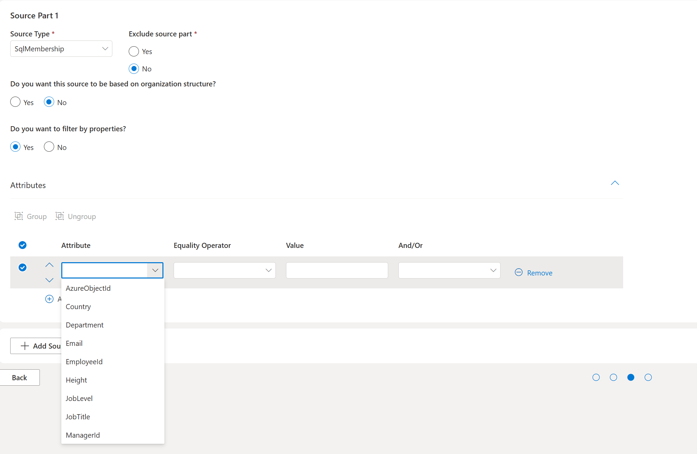
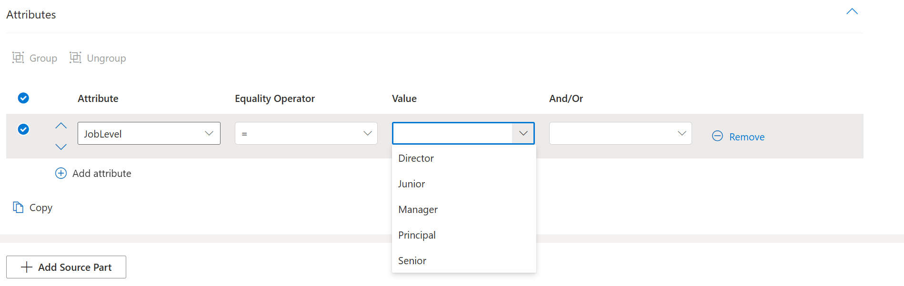
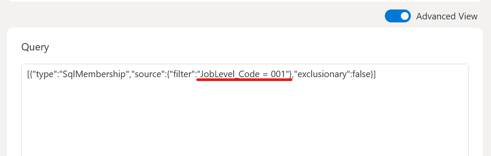
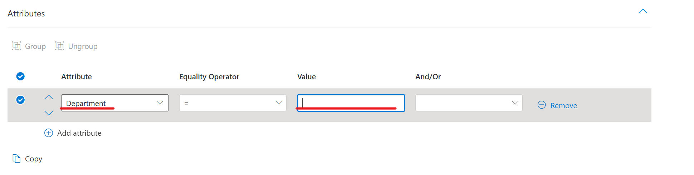
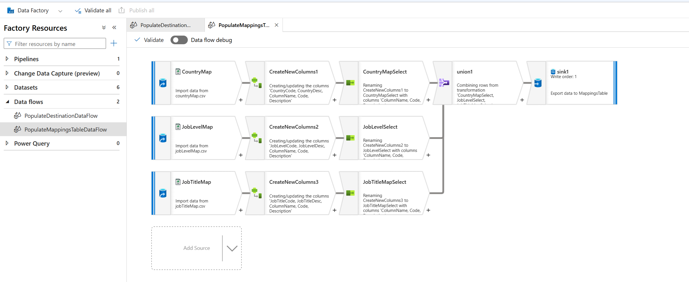
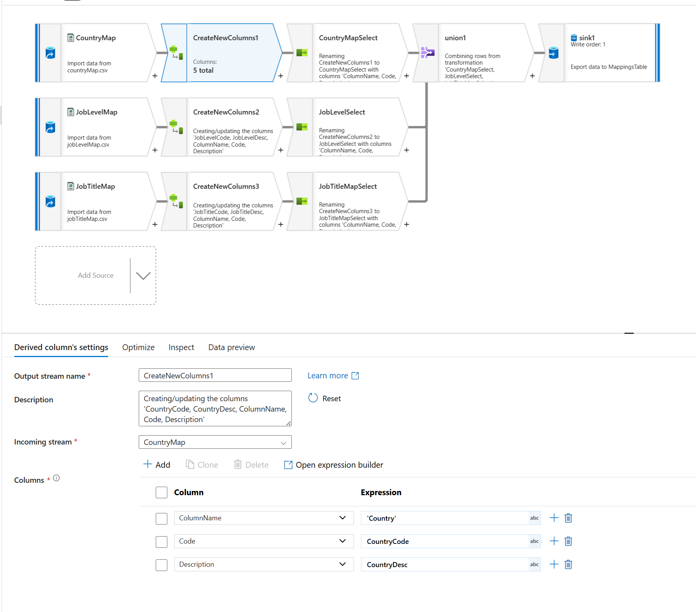
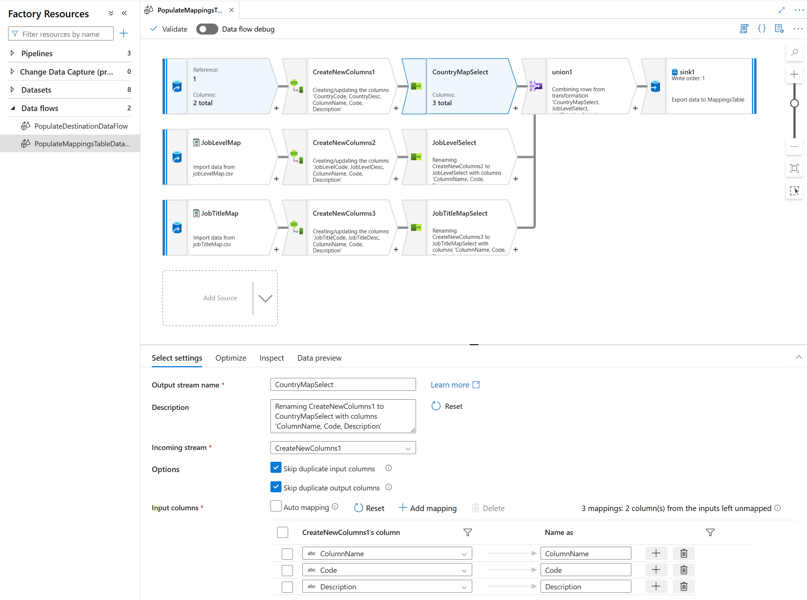
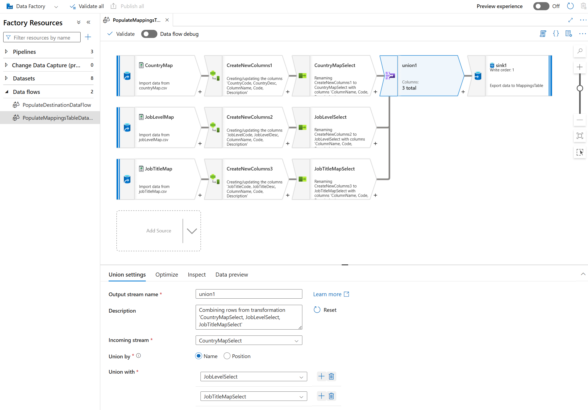
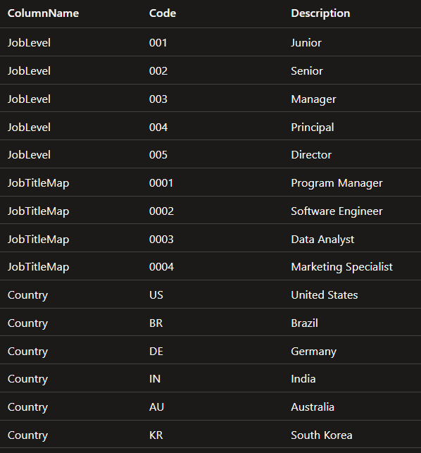
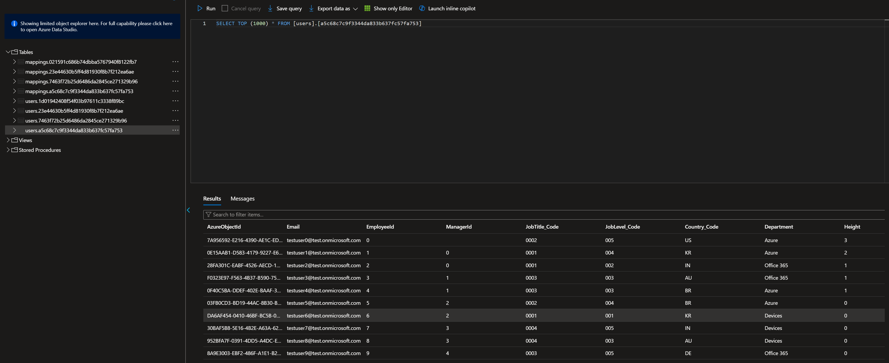

# Azure Data Factory Setup for HR-Driven Syncs

GMM supports **HR-driven syncs**, which allow you to synchronize group memberships based on data from your HR system (or other external data sources) rather than relying solely on existing Entra ID groups. This is useful when you need to create groups based on attributes like department, job title, location, or manager hierarchy that may not be available directly in Entra ID.

**Azure Data Factory (ADF)** serves as the ETL (Extract, Transform, Load) pipeline to:
- Pull user data from various sources (CSV files, databases, APIs, etc.)
- Transform and join the data into the format GMM expects
- Load the data into a SQL database that GMM can query

This guide provides instructions for setting up a demo ADF pipeline. The concepts and patterns demonstrated here can be adapted for custom ADF solutions in production environments.

## Table of Contents

- [HR Driven Sync Setup](#hr-driven-sync-setup)
  - [Prerequisites](#prerequisites)
  - [Required Resources](#required-resources)
  - [Demo Setup Steps](#demo-setup-steps)
- [Using HR Driven Syncs](#using-hr-driven-syncs)
  - [Example Queries](#example-queries)
  - [Leveraging Mappings in the UI](#leveraging-mappings-in-the-ui)
- [Understanding the Mappings Table](#understanding-the-mappings-table)

---

## HR Driven Sync Setup

### Prerequisites

- GMM deployment completed successfully (see [Deploying GMM](Deploying_GMM.md))
- Access to the Azure Portal with appropriate permissions
- For demo setup: A demo tenant created following the [Create Demo Tenant](../../Documentation/CreateDemoTenant/CreateDemoTenant.md) guide

### Required Resources

After completing the deployment, you should observe the following resources necessary for HR-driven syncs:

| Resource | Type | Resource Group |
|----------|------|----------------|
| `<SolutionAbbreviation>-compute-<EnvironmentAbbreviation>-SqlMembershipObtainer` | Function App | `<SolutionAbbreviation>-compute-<EnvironmentAbbreviation>` |
| `<SolutionAbbreviation>-data-<EnvironmentAbbreviation>-adf` | SQL Database | `<SolutionAbbreviation>-data-<EnvironmentAbbreviation>` |
| `<SolutionAbbreviation>-data-<EnvironmentAbbreviation>-adf` | Data Factory (V2) | `<SolutionAbbreviation>-data-<EnvironmentAbbreviation>` |

> **Note:** To enable HR-driven syncs, the `<SolutionAbbreviation>-data-<EnvironmentAbbreviation>-adf` database must be populated with users from your tenant. The [Demo Setup Steps](#demo-setup-steps) below demonstrate one way to accomplish this.

### Data Requirements

Regardless of the approach used to populate the database with HR data, GMM has specific requirements for the table structure:

> **How GMM Finds Your Data:** GMM queries Azure Data Factory for the last successful run of the pipeline and uses the pipeline Run ID to locate the latest HR tables. This allows you to update your HR data by simply re-running the pipeline—GMM will automatically pick up the new tables.

**Destination Table Requirements:**
- **Table name:** Must follow the pattern `[users].<ADF-Pipeline-Run-Id>` (e.g., `[users].00000000-0000-0000-0000-000000000000`)
- **Required columns:** The destination table **must** contain the following columns:
  | Column | Description |
  |--------|-------------|
  | `EmployeeId` | Unique identifier for the employee |
  | `ManagerId` | Identifier of the employee's manager |
  | `AzureObjectId` | The user's Entra ID (Azure AD) object ID |

- **Additional columns:** You can include as many additional attribute columns as needed (e.g., `Department`, `JobTitle_Code`, `Country_Code`) as long as the required columns above are present. These additional columns can be used for filtering in your sync job queries.

**Mappings Table Requirements:**
- **Table name:** Must follow the pattern `[mappings].<ADF-Pipeline-Run-Id>` (e.g., `[mappings].00000000-0000-0000-0000-000000000000`)
- **Required columns:** If using mappings, the table must **only** contain:
  | Column | Description |
  |--------|-------------|
  | `ColumnName` | Name of the attribute/column being mapped |
  | `Code` | The code value used in queries |
  | `Description` | Human-readable description shown in the UI |


### Demo Setup Steps

Below is an example of how GMM populates users in `<SolutionAbbreviation>-data-<EnvironmentAbbreviation>-adf`. 

> **Note:** This example uses a demo tenant. For production environments, users should be within the tenant where your resources are deployed.

1. Create the demo tenant by following the [documentation](https://github.com/microsoftgraph/group-membership-management/blob/main/Documentation/CreateDemoTenant/CreateDemoTenant.md).
2. Create users in your demo tenant by running [this](https://github.com/microsoftgraph/group-membership-management/tree/main/Service/GroupMembershipManagement/Hosts/Console/DemoUserSetup) console app. By default, the console will create `10` users in your demo tenant. You can update this configurable value to add more users.
3. After running the console app, you should see users created within your demo tenant.
4. Within the console app's folder, locate the newly created `output` folder. This folder will contain two types of files: user files and mapping files. We will use the user files to construct a demo destination table. The purpose of doing this is to simulate the need to pull data from different sources to create the destination table and to showcase Azure Data Factory as a solution to this problem. We will use the mapping files to create the mappings table. This mappings table will be leveraged by the GMM UI to display the descriptions of user attributes while using codes to build the job queries. Using codes to build queries ensures that if there are any changes to the descriptions of these codes no changes need to be made to the queries. 

    Here are user files: 
    - `memberids.csv`
        - columns: 
            - PersonnelNumber
    - `memberHRData.csv`
        - columns: 
            - EmployeeIdentificationNumber
            - ManagerIdentificationNumber
            - Department
            - JobTitleCode
            - JobLevelCode
            - CountryCode
    
    *Please note that `EmployeeIdentificationNumber` and `ManagerIdentificationNumber` are required columns within the source file to onboard a job successfully. The names of `EmployeeIdentificationNumber` and `ManagerIdentificationNumber` can be different. The names will be renamed to `EmployeeId` and `ManagerId` respectively in the destination table.*

    Here are the mapping files: 
    - `JobTitleMap`
        - columns: 
            - JobTitleCode
            - JobTitleDesc
    - `JobLevelMap`
        - columns: 
            - JobLevelCode
            - JobLevelDesc
    - `CountryMap`
        - columns: 
            - CountryCode
            - CountryDesc

5. Locate the `<SolutionAbbreviation><EnvironmentAbbreviation>adf` storage account in your `<SolutionAbbreviation>-data-<EnvironmentAbbreviation>` resource group.
6. Within the storage account, locate the `csvcontainer` container and upload the user and mapping files to it. Azure Data Factory will access these files from this location.
7. Go to the `<SolutionAbbreviation>-data-<EnvironmentAbbreviation>-adf` Data factory (V2) resource within your `<SolutionAbbreviation>-data-<EnvironmentAbbreviation>` resource group and launch the Azure Data Factory Studio.
8. Once in the Azure Data Factory Studio, go to `Author` -> `Pipelines` -> `PopulateDestinationPipeline` -> `Add trigger` -> `Trigger now` to trigger the pipeline. This pipeline will join the two user csv files and create the destination table with the result. This pipeline will also join the mapping files and create the mappings table with the result. The mapping table will contain three columns: ColumnName, Code, and Description. 
9. Once the pipeline run is complete, you should see the destination and mappings tables created within the `<SolutionAbbreviation>-data-<EnvironmentAbbreviation>-adf` database. Both table names will be the ADF pipeline Run ID. The destination table will be under the `users` schema (EX: `[users].<ADF-Pipeline-Run-Id>`) and the mappings table will be under the `mappings` schema (EX: `[mappings].<ADF-Pipeline-Run-Id>`).
    
    Here are the columns in the destination table `[users].<ADF-Pipeline-Run-Id>`:
    - AzureObjectId
    - EmployeeId
    - ManagerId
    - Country_Code
    - JobLevel_Code
    - JobTitle_Code
    - Department
    - Email

        Note that:

        - Two additional columns are added to the destination table by the AzureUserReader: `AzureObjectId` and `Email`.
        - The columns that have mappings are renamed to follow the pattern of `<ColumnName>_Code` (EX: JobTitleCode -> JobTitle_Code). The GMM UI uses this pattern to recognize columns that have mappings. 
        - GMM expects the destination table to contain the columns `EmployeeId`, `ManagerId`, and `AzureObjectId`. 

    Here are the columns in the mappings table `[mappings].<ADF-Pipeline-Run-Id>`:
    - ColumnName
    - Code
    - Description

        Note that: 

        - The GMM UI expects these three columns in the mappings table. It uses these columns to convert descriptions to code and vice versa. 
        - For each column in the destination table named using the pattern `<ColumnName>_Code`, the GMM UI expect at least one entry in the mappings table where ColumnName is `<ColumnName>`

Now you are ready to onboard a group!

---

## Using HR Driven Syncs

### Example Queries

```json
[{"type":"SqlMembership","source":{"filter":"(Country_Code = 'US')"}}]
[{"type":"SqlMembership","source":{"filter":"(Department = 'Azure')"}}]
```

### Leveraging Mappings in the UI

Mappings provide a significantly improved user experience when creating and managing sync jobs. We **strongly recommend** setting up your mappings table from the start, even if you only have a few attributes to map.

#### Why Use Mappings?

| Without Mappings | With Mappings |
|------------------|---------------|
| Users must type attribute values as free text | Users select from a dropdown of available options |
| Prone to typos and invalid values | Eliminates input errors |
| Difficult to discover available filter options | Easy to browse all valid options |
| Description changes require query updates | Description changes are automatic—no query updates needed |

#### Future-Proofing Your Queries

One of the most important benefits of mappings is **query stability**. When you use mappings:

- **Queries use codes** (e.g., `Country_Code = 'US'`) which are stable identifiers that rarely change
- **The UI displays descriptions** (e.g., "United States") which are human-readable
- **If descriptions change**, GMM automatically displays the new descriptions without any impact to your existing queries

For example, if your HR system renames "United States" to "USA", all your existing queries continue to work because they reference the code `US`, not the description. The UI will simply show the new description to users.

> **Tip:** Setting up mappings early avoids the complexity of migrating existing jobs later. Adding mappings after jobs are created requires updating those jobs to use the new `<ColumnName>_Code` column naming pattern.

#### Mappings in Action

When creating a SqlMembership source part in the UI, you'll see the list of available filter attributes:



For attributes that have mappings configured, you can select from a dropdown of available descriptions:



Switching to `Advanced View` reveals how the UI automatically builds the query using the code (not the description):



For attributes **without** mappings (like `department` in this example), users must enter values manually as free text:



---

## Understanding the Mappings Table

The demo ADF pipeline leverages the `PopulateMappingsTableDataFlow` data flow to create the mappings table. Here is how it looks:



In this case, we have three maps: CountryMap, JobLevelMap, and JobTitleMap. These are our inputs. For each of these maps, we will do two transformations: 

- Create extra columns: 
 - The GMM UI expects three columns: 
    - ColumnName: this is the name of the attribute/column in the table. 
    - Code: this is the given code being mapped to a description.
    - Description: this is the given descriptio bring mapped to a code. 
- Select only the columns ColumnName, Code, and Description. 

Once we have these three columns for each of our maps, we union the maps so that we end up with one table containing all of our maps. This is the mapping table.

### Data Flow Transformations

Here is the transformation used to create the extra columns for the Country map:



Here is the transformation used to select only the columns that we need:



Here is the union of our three maps into one table:



Here is the resulting mappings table:



### Column Naming Convention

> **Important:** In order for the GMM UI to recognize columns that have maps, these columns must follow the naming pattern `<ColumnName>_Code`.

Notice this pattern in the destination table:


