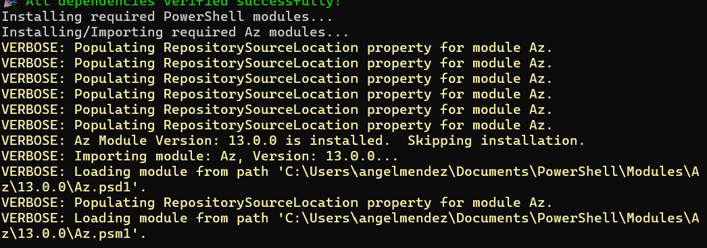
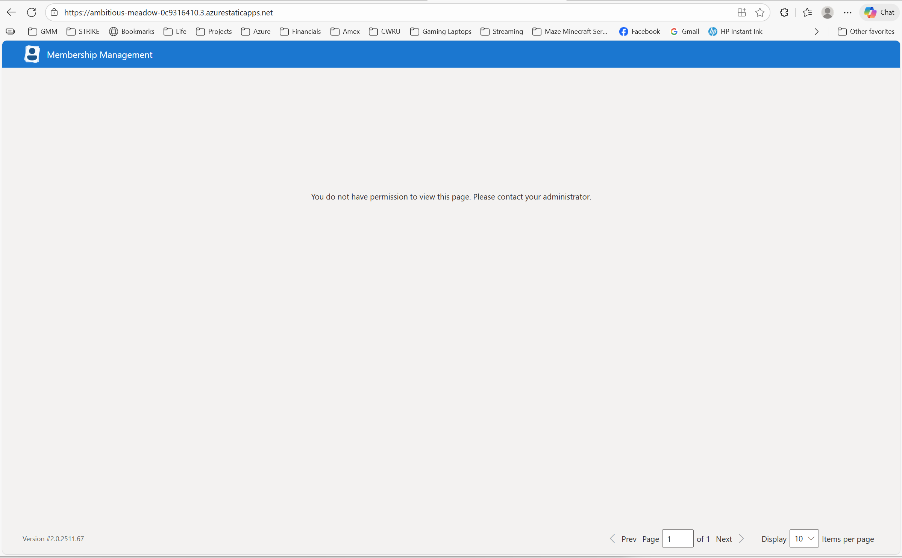

## Group Membership Management Deployment Script
Deploy GMM resources using Deploy-Resources.ps1 script.  
This script will deploy all resources in the specified environment with minimal user input.

---

### Related Documentation

- [GMM Resource Overview](GMM_Resources.md) - Overview of all Azure resources deployed by GMM

---

### What the Deployment Script Does

The deployment script automates the complete setup of the GMM environment. At a high level, it performs the following steps:

1. **Validates Dependencies & Permissions**
   - Ensures PowerShell 7.0+ (64-bit) is running
   - Installs required modules (Az, Microsoft.Graph, MSIdentityTools) if not present
   - Installs Node.js tooling (pnpm, swa CLI) if not present
   - Validates the user has required Azure and Entra ID permissions

2. **Creates App Registrations**
   - Sets up the four required Entra ID app registrations (UI, WebAPI, Graph, TeamsChannel)
   - Stores application credentials in Key Vault

3. **Deploys Resource Groups**
   - Creates the three resource groups: `prereqs`, `data`, and `compute`

4. **Deploys Prereqs Resources**
   - Creates the prereqs Key Vault for storing secrets and credentials
   - Configures firewall rules and grants the deploying user Key Vault access

5. **Deploys Data Resources**
   - Creates SQL Server, databases, Service Bus, storage accounts, App Configuration, and monitoring resources
   - Creates the data Key Vault for connection strings and keys

6. **Deploys Compute Resources**
   - Creates all Azure Function Apps and their dedicated storage accounts
   - Creates the WebAPI App Service and SignalR service
   - Creates the Static Web App for the UI

7. **Deploys Azure Data Factory Resources**
   - Creates ADF pipelines for HR data integration (deployed to the data resource group)

8. **Configures Permissions & Access**
   - Grants SQL database permissions to function apps and the WebAPI
   - Assigns RBAC roles to managed identities
   - Configures CORS settings for the WebAPI and SignalR

9. **Deploys Application Code**
   - Publishes code to all Azure Function Apps
   - Publishes code to the WebAPI
   - Builds and deploys the React UI to the Static Web App

10. **Runs Database Migrations**
    - Triggers Entity Framework migrations via the WebAPI

For a complete list of all Azure resources created, see the [GMM Resource Overview](GMM_Resources.md).

---

### Prerequisites

#### User-Required Prerequisites
These must be installed before running the deployment script:

- [PowerShell 7.0](https://learn.microsoft.com/en-us/powershell/scripting/install/installing-powershell-on-windows?view=powershell-7.4) or later (64-bit) is required to run the script.

#### Auto-Installed by Script
The following dependencies will be automatically installed by the script if not present:

| Dependency | Description |
|------------|-------------|
| **Node.js v22** | JavaScript runtime required for UI build tools |
| **pnpm** | Fast, disk space efficient package manager |
| **swa CLI** | Azure Static Web Apps CLI for UI deployment |
| **Az PowerShell Module** | Azure resource management |
| **Microsoft.Graph Modules** | Microsoft Graph API operations |
| **MSIdentityTools** | Azure IP range retrieval for firewall rules |

---

### Required Permissions

#### Subscription-Level Permissions
The deploying user must have one of the following:
- **Owner** role on the target Azure subscription, OR
- An equivalent custom role with permissions to create resource groups, deploy resources, and assign roles

#### Directory-Level Permissions
The deploying user must have one of the following Microsoft Entra ID roles:
- **Global Administrator**, OR
- **Privileged Role Administrator**

> **Note:** If you do not have directory-level permissions, you can set `SkipPrivilegedDirectoryActions` to `true` in the parameters file. This will require you to manually create the app registrations before deployment. See the [Important Parameters](#important-parameters) section for details.

---

### Pre-Deployment Setup

#### Create a SQL Administrators Security Group

Before deploying GMM, you must create a Microsoft Entra ID security group that will be granted administrator access to the SQL Server. Members of this group will have full administrative privileges on the GMM SQL databases.

1. Navigate to the [Azure Portal](https://portal.azure.com) and go to **Microsoft Entra ID**.
2. Click on **Groups** in the left menu.
3. Click **+ New group**.
4. Set **Group type** to **Security**.
5. Enter a **Group name** (e.g., `GMM SQL Admins`).
6. Add the users who should have SQL administrator access as **Members**.
7. Click **Create**.
8. After creation, open the group and copy the **Object ID** - you will need this for the `sqlAdministratorsGroupId` parameter.

> **Note:** The deploying user should be a member of this group to ensure they can access the SQL databases during and after deployment.

---

### Configuring Parameters

Before running the deployment, update the [parameters.json](../parameters.json) file with your environment values.

#### Required Parameters

| Parameter | Description | Example |
|-----------|-------------|---------|
| `solutionAbbreviation` | Short name for the solution (used in resource naming) | `gmm` |
| `environmentAbbreviation` | Environment identifier | `int`, `ua`, `prod` |
| `subscriptionId` | Azure subscription ID for deployment | `xxxxxxxx-xxxx-xxxx-xxxx-xxxxxxxxxxxx` |
| `location` | Azure region for resources | `eastus` |
| `uiLocation` | Azure region for Static Web App | `eastus2` |
| `tenantId` | Microsoft Entra ID tenant ID | `xxxxxxxx-xxxx-xxxx-xxxx-xxxxxxxxxxxx` |
| `sqlAdministratorsGroupId` | Object ID of the SQL administrators security group | `xxxxxxxx-xxxx-xxxx-xxxx-xxxxxxxxxxxx` |
| `sqlAdministratorsGroupName` | Display name of the SQL administrators group | `GMM SQL Admins` |
| `appConfigurationDataOwners` | List of principals who will own App Configuration data | `[{"principalId": "xxxxxxxx-xxxx-xxxx-xxxx-xxxxxxxxxxxx", "principalType": "User"}]` |
| `authenticationType` | Authentication method for the Graph application | `UserAssignedManagedIdentity`, `ClientSecret`, or `Certificate` |

---

### Important Parameters

Each parameter in the [parameters.json](../parameters.json) file includes a description. The following parameters are worth noting for their impact on deployment behavior:

#### `skipPrivilegedDirectoryActions`

**Recommended: `false` (default)**

It is recommended to leave this set to `false`. The script will perform all necessary actions automatically.

Set this to `true` only if you want more control over what permissions you grant the deployment script, or if you do not have the required Entra ID directory permissions (Global Administrator or Privileged Role Administrator).

When set to `true`:
- You must create the four app registrations manually before running the deployment, or run the individual setup scripts separately with appropriate permissions
- The script will pause and prompt you for action when manual steps are required
- If `authenticationType` is set to `ClientSecret`, you will be prompted to input the client secrets you created manually

For manual app registration setup, see the documentation in:
- [Manual Setup Documentation](../../Scripts/ApplicationSetupScripts/Manual%20Setup%20Documentation/)

Alternatively, you can run the individual setup scripts located in:
- [ApplicationSetupScripts](../../Scripts/ApplicationSetupScripts/)

#### `authenticationType`

Specifies the authentication method for the Graph application. Valid values are:
- `UserAssignedManagedIdentity` **(Recommended)** - Uses a user-assigned managed identity. This is the most secure option as it requires no secrets to manage.
- `ClientSecret` - Uses a client secret. **Not recommended** due to the overhead of secret management and rotation.
- `Certificate` - Uses a certificate for authentication.

#### `isInitialDeployment`

Set this to `true` for the first deployment of GMM to an environment.

When set to `false` (for subsequent deployments):
- The script will stop the JobTrigger function app before deployment begins to prevent sync jobs from running during the update
- After deployment completes, the script performs a reset operation to ensure all jobs are in a consistent state
- This prevents issues that could arise from jobs running while infrastructure or code is being updated

#### `sqlAdministratorsGroupId` and `sqlAdministratorsGroupName`

These parameters specify the Microsoft Entra ID security group that will be granted administrator access to the SQL Server.

- `sqlAdministratorsGroupId` - The Object ID of the security group
- `sqlAdministratorsGroupName` - The display name of the security group

Members of this group will have full administrative privileges on the GMM SQL databases. See [Create a SQL Administrators Security Group](#create-a-sql-administrators-security-group) for instructions on creating this group.

---

### Deployment

The script [Deploy-Resources.ps1](../Deploy-Resources.ps1) and the [parameters.json](../parameters.json) files are located in the Deployment folder.

PowerShell scripts might be blocked in your environment. To unblock the scripts, run the following command in PowerShell 7.x from the root directory:

```powershell
Get-ChildItem -Recurse | Unblock-File
```

> ⚠️ **Important: Session Requirements**
> 
> - Run the deployment script in a **fresh PowerShell 7.x session**
> - **Do not run any Azure login commands** (`Connect-AzAccount`, `Connect-MgGraph`, etc.) before running the script
> - The script will prompt you to authenticate when needed
> - This ensures the script can enforce the correct module versions and authentication scopes

From the Deployment folder, run the following commands:

```powershell
. .\Deploy-Resources.ps1

Deploy-Resources
```

The script will prompt you to log in to your Azure account during execution.

> ℹ️ **Note:** The installation / import of the Az PowerShell modules can take **up to 7 minutes**. Please be patient during this process.
>
> 

---

### Deployment Retry Behavior

The deployment script includes automatic retry logic for transient failures. If you see a message like this:

```
WARNING: ❌ Deployment failed unexpectedly: Deployment failed. See logs above.
WARNING: 'Create data resources' failed, retrying again in 20 seconds... Retry attempt (1/6)
```

> ⚠️ **Do not interrupt the script.** Let it retry automatically. The script will attempt up to 6 retries with increasing delays between attempts. Only intervene if the script exhausts all retries and reports a final failure.

#### Investigating Deployment Failures

If the script fails at a deployment step and exhausts all retries, you can view detailed error information in the Azure Portal:

1. Navigate to the [Azure Portal](https://portal.azure.com).
2. Go to **Resource groups** and select the resource group where the failure occurred (e.g., `<solutionAbbreviation>-data-<environmentAbbreviation>`).
3. Click on **Deployments** in the left menu.
4. Find the failed deployment and click on it to view the error details.

This will show you the specific Azure Resource Manager error that caused the failure, which can help diagnose issues like quota limits, naming conflicts, or permission problems.

---

## Post Deployment

The deployment script creates the following app registrations in Microsoft Entra ID. An administrator must grant admin consent for the API permissions assigned to these applications.

**App Registrations Created:**
- `<solution-abbreviation>-ui-<environment-abbreviation>`
- `<solution-abbreviation>-webapi-<environment-abbreviation>`
- `<solution-abbreviation>-Graph-<environment-abbreviation>`
- `<solution-abbreviation>-TeamsChannel-<environment-abbreviation>`

> **Note:** If you set `SkipPrivilegedDirectoryActions` to `true`, you must create these app registrations manually before running the deployment script.

**To grant admin consent:**
1. Navigate to the [Azure Portal](https://portal.azure.com) and go to Microsoft Entra ID.
2. Click on **App Registrations**.
3. Search for each deployed application listed above.
4. For each application, under **Manage**, click on **API Permissions**, then click **Grant admin consent for `<your-tenant>`**.

The WebApi provides roles that can be assigned to users. See these relevant sections:  
- [Roles as policy to gate functionality](https://github.com/microsoftgraph/group-membership-management/blob/main/Service/GroupMembershipManagement/Hosts/WebApi/Documentation/WebApiSetup.md#roles-as-policy-to-gate-functionality)
- [Add a role to a group](https://github.com/microsoftgraph/group-membership-management/blob/main/Service/GroupMembershipManagement/Hosts/WebApi/Documentation/WebApiSetup.md#add-a-role-to-a-group)

### Assigning WebAPI App Roles to Users

After deployment, if users attempt to access the GMM UI without the required app roles assigned, they will see the following error:



*"You do not have permission to view this page. Please contact your administrator."*

To grant a user access to the GMM UI, you must assign the appropriate WebAPI app roles to them. Follow these steps in the Azure Portal:

1. Navigate to the [Azure Portal](https://portal.azure.com) and go to **Microsoft Entra ID**.
2. Click on **Enterprise applications** in the left menu.
3. Search for and select `<solutionAbbreviation>-webapi-<environmentAbbreviation>`.
4. Under **Manage**, click on **Users and groups**.
5. Click **+ Add user/group**.
6. Under **Users**, click **None Selected** and search for the user you want to grant access to. Select the user and click **Select**.
7. Under **Role**, click **None Selected**. You will see a list of available roles.
8. Select the role(s) you want to assign to the user:

   | Role | Description |
   |------|-------------|
   | Job Reader | Can read owned destinations in the tenant |
   | Job Owner Enabler/Disabler | Can enable or disable owned destinations in the tenant |
   | Job Owner Deleter | Can delete the job from GMM (disable GMM sync) |
   | Job Owner Configuration Editor | Can update owned destinations' configuration |
   | Job Owner Writer | Can create, view, and update owned destinations in the tenant |
   | Job Tenant Reader | Can read all destinations in the tenant |
   | Job Tenant Writer | Can create, view, and update all destinations in the tenant |
   | Submission Reviewer | Can view and manage Submission Requests for all groups |
   | Submission Rejector | Can view and reject Submission Requests for all groups |
   | Hyperlink Administrator | Can add, update, or remove custom URLs |
   | Custom Membership Provider Administrator | Can add, update, or remove custom field names |
   | General Settings Administrator | Can update general settings |
   | Reset Administrator | Can reset or stop GMM |

9. Click **Select** after choosing the desired role(s).
10. Click **Assign** to complete the role assignment.

> **Note:** You must repeat steps 5-10 for each role you want to assign, as the Azure Portal only allows assigning one role at a time per assignment operation.

> **Tip:** For administrators who need full access, assign all roles listed above.

### Creating and uploading the certificate

If you opted to use a certificate for the Microsoft Graph API `<solutionAbbreviation>-Graph-<environmentAbbreviation>`, follow these steps to complete the configuration.

1. Create a self-signed certificate. See [Quickstart: Set and retrieve a certificate from Azure Key Vault using the Azure portal](https://docs.microsoft.com/en-us/azure/key-vault/certificates/quick-create-portal)
2. Upload the certificate to your `<solutionAbbreviation>`-Graph-`<environmentAbbreviation>` application.

    We need to upload the certificate to the `<solutionAbbreviation>`-Graph-`<environmentAbbreviation>` application, in order to do that, we need to export it from the prereqs keyvault.

    Exporting the certificate:

    1. In the Azure Portal navigate to your prereqs keyvault, it will be named following this convention `<solutionAbbreviation>`-prereqs-`<environmentAbbreviation>`.
    2. Locate and click on the Certificates blade on the left menu.
    3. Click on your certificate from the list.
    4. Click on the latest version.
    5. On the top menu click on 'Download in CER format' button to download the certificate.

    If you need more details on how to export the certificate please see [Quickstart: Set and retrieve a certificate from Azure Key Vault using the Azure portal](https://docs.microsoft.com/en-us/azure/key-vault/certificates/quick-create-portal) documentation.

    Uploading the certificate:

    1. In the Azure Portal navigate to Microsoft Entra ID. If you don't see it on your screen you can use the top search bar to locate it.
    2. Navigate to 'App registrations' blade on the left menu.
    3. Click on 'All applications" to locate and open your `<solutionAbbreviation>`-Graph-`<environmentAbbreviation>` application.
    4. On your application screen click on 'Certificates and secrets' blade on the left menu.
    5. Click on the 'Upload certificate' button.
    6. Locate and add your certificate.

3. Delete the Client secret.

      1. Under Certificates & secrets, click on the Client secrets.
      2. Delete the secret that was created as part of the deployment.
