# RunLimiter Feature Documentation

## Overview

The **RunLimiter** is a concurrency control system that limits the number of sync jobs that can be processed simultaneously. It prevents overloading downstream services (particularly the Microsoft Graph API) by queuing excess work and processing it as capacity becomes available.

## Why RunLimiter Exists

Without concurrency control, GMM could:
- **Exhaust Graph API quotas** - Leading to throttling (HTTP 429) and degraded performance
- **Overwhelm system resources** - Memory pressure on Azure Functions
- **Create unpredictable latency** - Large jobs starving smaller ones

The RunLimiter solves these problems by:
- Limiting concurrent processing to configurable thresholds
- Queuing excess work using Service Bus deferred messages
- Automatically dispatching queued work when capacity frees up
- Supporting different limits for different job sizes (lanes)

## Key Concepts

### Lanes

Jobs are categorized into **lanes** based on the number of membership changes:

| Lane | Max Concurrent Jobs | Lease Timeout | Heartbeat Interval |
|------|---------------------|---------------|-------------------|
| **Small** | 16 | 2 minutes | Disabled |
| **Large** | 3 | 15 minutes | 3 minutes |

- **Small lane**: Quick jobs that typically complete in under 2 minutes
- **Large lane**: Long-running jobs that require heartbeats to maintain their lease

### Leases

A **lease** represents permission to process a job. Key properties:
- **RunId**: Unique identifier for the sync job
- **Expiry**: When the lease automatically expires if not renewed/completed
- **Idempotent**: Acquiring the same RunId multiple times returns success

### Deferred Messages

When the system is at capacity, incoming jobs are **deferred** in Service Bus:
- The message stays in the queue but is not visible to consumers
- It can only be retrieved by its **sequence number**
- An index entity tracks all deferred messages for later processing

## Architecture Components

### MessageSplitter (Capacity Management)

| Component | Purpose |
|-----------|---------|
| `StarterFunction` | Entry point - routes to pending queue when RunLimiter enabled |
| `PendingDispatcherFunction` | Receives pending messages, defers them, triggers indexing |
| `DeferredPendingEnqueueOrchestrator` | Adds items to index, kicks drain |
| `DeferredPendingDrainOrchestrator` | Main logic - acquires leases, dispatches work |
| `RunLimiter` (Entity) | Tracks active leases per lane |
| `DeferredPendingIndexEntity` | Tracks pending work items |
| `CompletionListenerFunction` | Receives completion signals, releases leases |
| `LeaseRenewListenerFunction` | Processes heartbeats to extend leases |
| `DeferredPendingSweepFunction` | Periodic cleanup of expired leases |

### GraphUpdater (Job Execution)

| Component | Purpose |
|-----------|---------|
| `StarterFunction` | Receives messages, session-enabled for large lane |
| `OrchestratorMultiLaneFunction` | Processes sync job, sends heartbeats, emits completion |
| `MessageSplitterCompletionSenderFunction` | Sends completion signal to MessageSplitter |
| `MessageSplitterLeaseRenewSenderFunction` | Sends heartbeat to extend lease |
| `JobTrackerEntity` | Tracks job state including `CompletionSent` flag |

## Flow Charts

> **Diagram Legend**: Component names are prefixed to indicate which Azure Function they belong to:
> - **MS.** = MessageSplitter function
> - **GU.** = GraphUpdater function

### Main Flow: Job Processing with RunLimiter



This diagram shows the complete flow from when a job arrives at MessageSplitter through processing and completion:

1. **Entry**: Job arrives and is routed to pending queue if RunLimiter is enabled
2. **Deferral**: Message is deferred and indexed for later processing
3. **Drain**: Orchestrator acquires leases and dispatches work as capacity allows
4. **Execution**: GraphUpdater processes the job
5. **Completion**: Signal releases the lease and kicks drain for waiting jobs

### GraphUpdater Processing Flow



This diagram shows how GraphUpdater processes messages:

1. **Large lane** jobs start a heartbeat loop to maintain their lease
2. **Small lane** jobs process directly without heartbeat
3. After processing, completion signal is sent if RunLimiter is enabled

### Lease Lifecycle



This diagram shows the complete lifecycle of a lease through four phases:

**1. Lease Acquisition**
- `MS.DeferredPendingDrainOrchestrator` calls `RunLimiter.Acquire()`
- If capacity available: Lease created with RunId and expiry time
- If at capacity: Request denied, job remains in pending queue

**2. Lease Active (Job Processing)**
- `GU.OrchestratorMultiLaneFunction` processes membership changes
- **Large lane**: Sends heartbeat every 3 minutes to extend lease (15 min timeout)
- **Small lane**: No heartbeat, must complete within 2 minutes

**3. Lease Release (Normal Completion)**
- Job completes → `GU.MessageSplitterCompletionSenderFunction` sends signal
- `MS.CompletionOrchestratorFunction` calls `RunLimiter.Release()`
- Lease removed, capacity freed, drain kicked for waiting jobs

**4. Lease Expiration (Failure Recovery)**
- If job crashes or hangs without sending heartbeats
- Lease expiry time passes
- `MS.DeferredPendingSweepFunction` (every 5 min) calls `RunLimiter.Prune()`
- Expired leases removed, capacity freed for waiting jobs

### Deferred Message Sequence



This sequence diagram shows the interaction between components:

1. Message arrives at PendingDispatcher
2. Message is deferred in Service Bus (held by sequence number)
3. Item is added to the index entity
4. Drain is kicked to process pending items
5. For each item, lease is acquired before dispatching

### Large Lane Session Queue Sequence



This diagram shows how session queues guarantee ordered processing:

1. Multiple messages for the same job have the same SessionId (RunId)
2. Service Bus delivers messages sequentially per session
3. StarterFunction waits for each orchestrator to complete before processing the next message
4. Only the last message sends the completion signal

## Configuration

The RunLimiter is configured via Azure App Configuration:

```
RunLimiterSettings:IsEnabled = true/false
RunLimiterSettings:MaxInFlightMessages = 16 (small) or 3 (large)
RunLimiterSettings:LeaseTimeoutMinutes = 2 (small) or 15 (large)
RunLimiterSettings:HeartbeatIntervalMinutes = 0 (small) or 3 (large)
```

### Infrastructure (Bicep)

New Service Bus subscriptions are created:

| Subscription | Purpose | Filter |
|--------------|---------|--------|
| `Pending_Small` | Pending small jobs | `MessageType = 'pending_small'` |
| `Pending_Large` | Pending large jobs | `MessageType = 'pending_large'` |
| `Completion_Small` | Completion signals | `MessageType = 'completion_small'` |
| `Completion_Large` | Completion signals | `MessageType = 'completion_large'` |
| `LeaseRenew_Large` | Heartbeat signals | `MessageType = 'lease_renew_large'` |

## Common Scenarios

### Scenario 1: Normal Processing (Under Capacity)

1. Job arrives at MessageSplitter
2. Sent to pending queue → deferred → indexed
3. Drain acquires lease immediately (capacity available)
4. Dispatches to GraphUpdater
5. GraphUpdater processes, sends completion
6. Lease released, capacity freed

### Scenario 2: At Capacity (Queued)

1. Job arrives, sent to pending queue
2. Drain tries to acquire lease → denied (at max)
3. Job stays in index with released in-progress marker
4. Another job completes → lease released → drain kicks
5. Queued job now gets lease and proceeds

### Scenario 3: Long-Running Large Job

1. Large job acquires lease (15 min timeout)
2. Every 3 minutes, orchestrator sends heartbeat
3. MessageSplitter renews lease on each heartbeat
4. Job can run for hours without losing lease
5. Completion sent when all messages processed

### Scenario 4: Crashed Job Recovery

1. Job acquires lease, starts processing
2. Function instance crashes (no completion sent)
3. No heartbeats → lease expires after timeout
4. Sweep runs (every 5 min) → prunes expired lease
5. Kicks drain → queued jobs can proceed

## Troubleshooting

### Symptoms and Causes

| Symptom | Possible Cause | Solution |
|---------|---------------|----------|
| Jobs stuck in pending | No completions being sent | Check GraphUpdater logs |
| Lease not found on renew | Lease expired before heartbeat | Increase HeartbeatIntervalMinutes |
| Duplicate completions | Race condition (should not happen) | Check session queue config |
| High drain lock contention | Too many concurrent drains | Normal - drain lock prevents this |

### Key Log Messages

```
DeferredPendingDrain: start lane=small
DeferredPendingDrain: no capacity; stopping drain lane=small inFlight=16
DeferredPendingDrain: completed lane=small processed=5 newlyDispatched=5
Completion processed; lane=small released=true. Kicking deferred drain.
Lease renew signal ignored; no existing lease found
```

## Key Design Decisions

### Why Deferred Messages?

- **Reliability**: Messages are never lost, even if function crashes
- **Ordering**: Maintains FIFO within the pending queue
- **Efficiency**: No polling - drain is triggered by events

### Why Durable Entities?

- **Consistency**: Serialized access prevents race conditions
- **Durability**: State survives function restarts
- **Simplicity**: Built-in locking semantics

### Why Session Queues for Large Lane?

- **Ordering**: All messages for a job processed sequentially
- **Single Consumer**: Only one orchestrator per RunId at a time
- **Completion Safety**: Only last message can emit completion

## Related Documentation

- [Azure Durable Entities](https://learn.microsoft.com/en-us/azure/azure-functions/durable/durable-functions-entities)
- [Service Bus Sessions](https://learn.microsoft.com/en-us/azure/service-bus-messaging/message-sessions)
- [Service Bus Deferred Messages](https://learn.microsoft.com/en-us/azure/service-bus-messaging/message-deferral)
