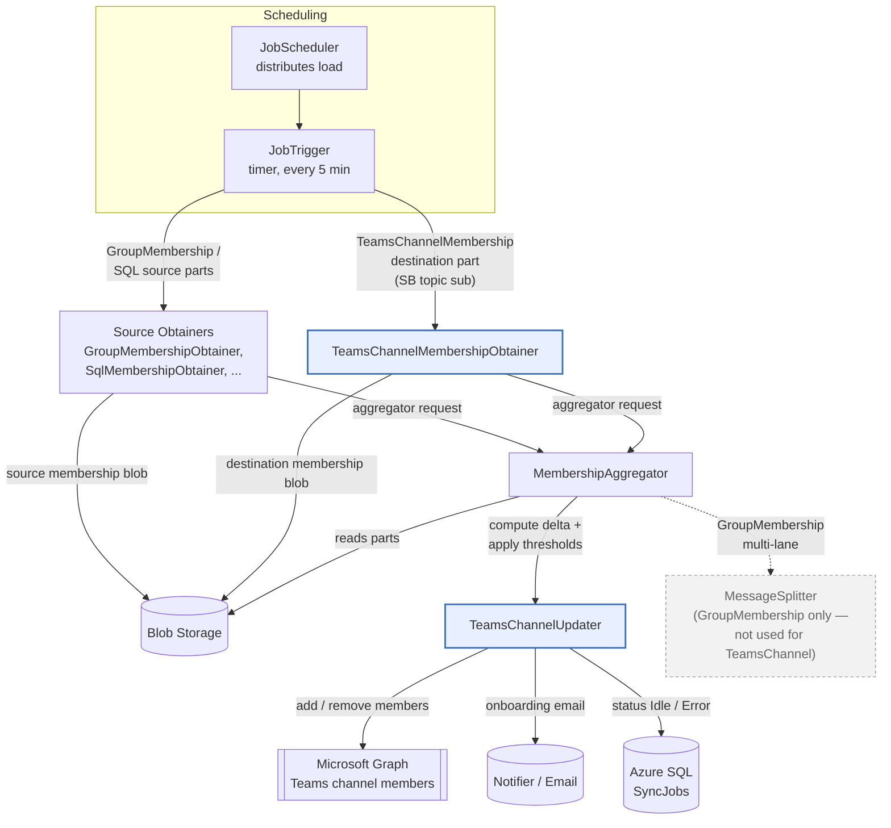
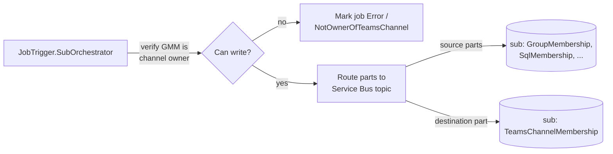
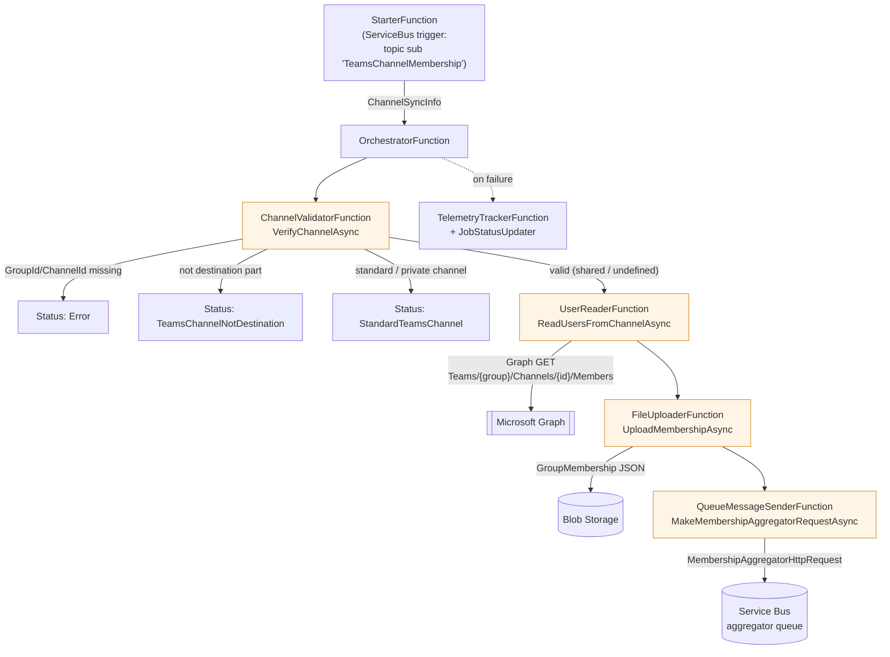
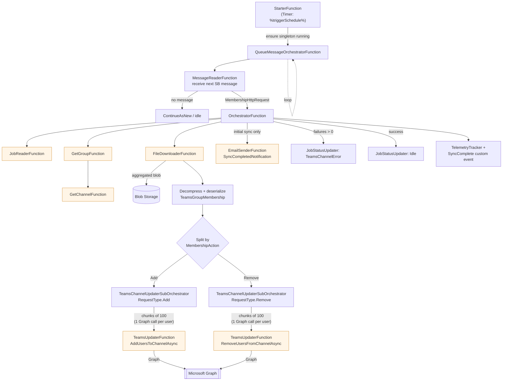
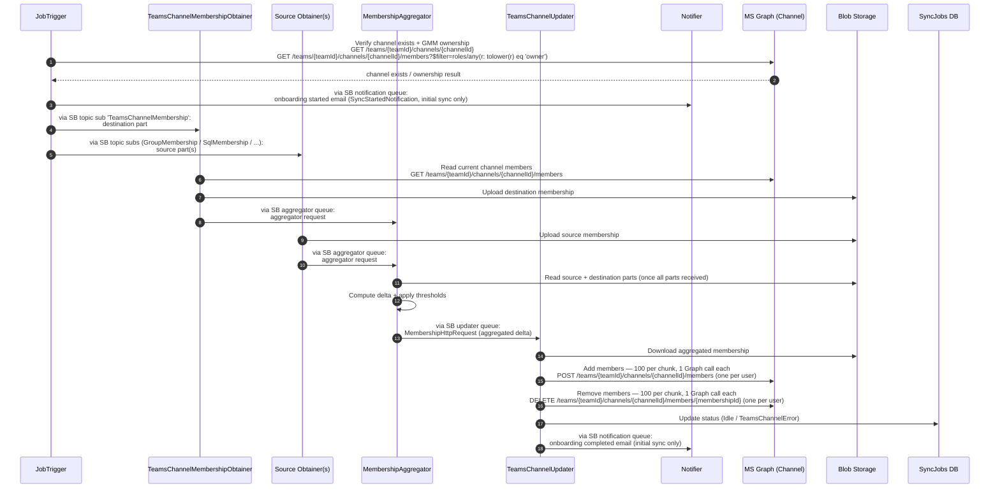

# TeamsChannel GMM Service Backend Architecture

This document describes the end-to-end architecture of the **TeamsChannel** sync path in Group Membership Management (GMM): how a sync job that targets a Microsoft Teams channel is scheduled, how its source membership is obtained, aggregated and thresholded, and how the channel's membership is finally updated via Microsoft Graph.

> **Scope.** TeamsChannel is currently supported only as a **destination** (the team/channel whose membership GMM keeps in sync). It supports **shared / undefined (flexible)** channels only. **Standard** and **private** channels are rejected during validation. See [`TeamsChannelSync.md`](./TeamsChannelSync.md) for the customer‑facing setup.

---

## 1. Components at a glance

| Component | Type | Role in the TeamsChannel path |
| --- | --- | --- |
| **JobTrigger** | Timer Function (every 5 min) | Detects due `TeamsChannelMembership` jobs, resolves the destination channel, verifies GMM can write to it, on initial sync enqueues the onboarding **started** email, and routes source parts onto Service Bus. |
| **GroupMembershipObtainer / SqlMembershipObtainer / etc.** | Durable Functions | Obtain the **source** membership parts of the query (who *should* be in the channel). |
| **TeamsChannelMembershipObtainer** | Durable Function | Reads the **current** membership of the destination Teams channel (the "destination part") via Graph and uploads it as a membership blob. |
| **MembershipAggregator** | Durable Function | Combines all source parts + the destination part, computes the add/remove delta, and applies owner thresholds. |
| **MessageSplitter** *(optional, multi‑lane)* | Function | Routes aggregated work into size‑based lanes (S/M/L) to avoid large jobs starving small ones. **GroupMembership only** — TeamsChannel destinations bypass it. |
| **TeamsChannelUpdater** | Durable Function | Consumes the aggregated delta and applies adds/removes to the Teams channel via Graph; on initial sync enqueues the onboarding **completion** email (Notifier sends it). |
| **Repositories.TeamsChannel** | Repository | Graph wrapper for all Teams channel operations (read members, channel type, add/remove members, ownership checks). |
| **Blob Storage** | Storage | Holds serialized membership files exchanged between functions. |
| **Service Bus** | Messaging | Topic subscription (`TeamsChannelMembership`) for obtaining; queues for aggregator and updater. |
| **Azure SQL** | Database | `SyncJobs` and `DestinationChannels` tables (channel group id + channel id, status). |

---

## 2. End-to-end flow (high level)

**Key idea:** TeamsChannel reuses the standard GMM pipeline. The two TeamsChannel‑specific functions are **TeamsChannelMembershipObtainer** (reads the *current* channel membership as the destination part) and **TeamsChannelUpdater** (writes the computed delta back to the channel). Aggregation and thresholding are shared with security‑group syncs. Multi‑lane/MessageSplitter routing, however, applies **only to `GroupMembership`** destinations — TeamsChannel jobs always route straight to the TeamsChannelUpdater.

---

## 3. JobTrigger routing

When `JobTrigger` (timer, every 5 minutes) processes a due job with `MembershipType == "TeamsChannelMembership"`:

1. Resolves the destination `Channel` (group id + channel id) from `syncJob.Channel` or via `GetChannelFunction`.
2. Verifies the channel exists and **GMM's service account is an owner** of both the team and the channel (`TeamsChannelExistsAndGMMCanWriteToItAsync` → `IsServiceAccountOwnerOfChannelAsync`).
3. On the **initial sync only** (`LastRunTime == MinValue`), enqueues an **onboarding "started" email** (`SyncStartedNotification`) to the Service Bus notification queue (`JobTriggerService.SendEmailAsync`); the **Notifier** sends the actual email.
4. Standardizes the destination string: `[{"type":"TeamsChannelMembership","value":{"objectId":"<groupId>","channelId":"<channelId>"}}]`.
5. Splits the job into its constituent source parts + the destination part and publishes them to the Service Bus topic. The destination part lands on the `TeamsChannelMembership` subscription consumed by **TeamsChannelMembershipObtainer**.

---

## 4. TeamsChannelMembershipObtainer (read the channel's current members)

A Service Bus–triggered durable function. It reads the **current** membership of the destination channel and hands it to the aggregator as the destination part.

**Notes**
- `VerifyChannelAsync` rejects `standard` and `private` channels; only `shared` / undefined (flexible) proceed.
- The uploaded blob path is `/{targetOfficeGroupId}/{timestamp}_{runId}_TeamsChannelMembership_{currentPart}.json` and contains a `GroupMembership` payload (the channel's current users as `SourceMembers`).
- Owners are excluded by default when reading channel members (`excludeOwners = true`).

---

## 5. Aggregation & thresholding (shared pipeline)

The MembershipAggregator waits until **all** parts for a run have arrived (source parts + the TeamsChannel destination part), then:

1. Downloads each part blob and unions the **source** parts (honoring exclusionary parts).
2. Compares the desired source set against the **destination** part (current channel membership).
3. Produces a delta: members **to add** (in source, not in channel) and members **to remove** (in channel, not in source).
4. Applies the group owner's **threshold** percentages; if exceeded, the job is held for review / a notification is sent instead of writing changes.
5. Emits a `MembershipHttpRequest` (with the aggregated membership blob path) toward the updater.

For TeamsChannel destinations, that request is routed (by `Type == TeamsChannelMembership`) onto the **TeamsChannelUpdater** Service Bus subscription rather than the GraphUpdater path. Note that **multi‑lane / MessageSplitter routing is applied only to `GroupMembership`** destinations (`TopicMessageSenderService` gates the lane logic on `MembershipType == GroupMembership`); TeamsChannel jobs always go directly to the updater regardless of size.

---

## 6. TeamsChannelUpdater (write the delta to the channel)

Unlike the obtainer, the updater is driven by a **timer**: a singleton `QueueMessageOrchestratorFunction` continuously drains the updater queue using `ContinueAsNew`.

**Notes**
- The sub‑orchestrator groups members into **chunks of 100** for orchestration only — this is **not** a Graph `$batch`. Within each chunk the repository loops **one Graph call per user** (a chunk of 100 = 100 sequential `POST`/`DELETE` calls). Transient failures are retried once before being recorded as failures.
- Adds and removes are processed as **separate** sub‑orchestrations so their success counts and telemetry are tracked independently.
- On the **initial sync** (`LastRunTime == FromFileTimeUtc(0)`), an onboarding **completion** email is enqueued to the Service Bus notification queue (the **Notifier** sends the actual email). This pairs with the onboarding **started** email already enqueued by JobTrigger on the first run (see §3).
- Final job status is `Idle` on full success, or `TeamsChannelError` if any user add/remove permanently failed.
- A `SyncComplete` telemetry event records members added/removed, not‑found counts, projected member count, and Success / PartialSuccess / Failure.

---

## 7. Repositories.TeamsChannel — Graph operations

All Graph interactions for Teams channels are centralized in `TeamsChannelRepository` (Microsoft Graph SDK). Key operations used by the sync path:

| Method | Used by | Purpose |
| --- | --- | --- |
| `GetChannelTypeAsync` | Obtainer (validation) | Returns `standard` / `private` / `shared`; standard and private are rejected (only `shared` / undefined proceeds). |
| `ReadUsersFromChannelAsync` | Obtainer (UserReader) | Pages through channel members (`Teams/{group}/Channels/{id}/Members`). |
| `AddUsersToChannelAsync` | Updater (TeamsUpdater) | Adds members; returns success / retry / not‑found buckets. |
| `RemoveUsersFromChannelAsync` | Updater (TeamsUpdater) | Removes members; returns success / failed‑removes. |
| `IsServiceAccountOwnerOfChannelAsync` | JobTrigger (verify) | Confirms GMM's service account owns the channel before writing. |
| `TeamsChannelExistsAsync` | JobTrigger (verify) | Confirms the channel still exists. |
| `GetGroupNameAsync` / `GetTeamsChannelNameAsync` | Updater / JobTrigger | Display names for notifications and job metadata. |

`DisabledTeamsChannelRepository` is injected when the `enableTeamsChannel` feature flag is off, so non‑TeamsChannel deployments incur no Teams Graph dependency.

---

## 8. Sequence diagram (single TeamsChannel sync run)

Messages flow **function → function**; where a hop travels through Service Bus, the arrow label names the topic subscription / queue it passes through. Participants are ordered so every message flows **left → right** (the only leftward arrow is the Graph ownership-check response).

