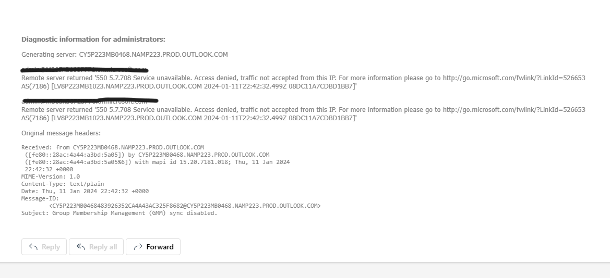

## Resolving Email Sending Issues in Demo Tenant

### Problem Overview
This document addresses a common issue encountered when sending emails through a demo tenant, typically resulting in failures due to IP address problems. This issue often arises from emails being sent from IP addresses with low reputation, a scenario frequent in new or trial tenants.

#### Issue snapshots

### Solution Steps
1. Access the Azure Portal
Action: Log into your demo tenant's Azure portal.

2. Initiate a Support Request
Action: Search for the 'Support Request' option within the portal and open a new ticket. The specific category chosen is less important, as the Azure team will redirect you to the appropriate team if necessary.

3. Provide Necessary Details
Action: Attach a screenshot of the email error you are experiencing.
Additional Resource: Include this [Microsoft Q&A](https://statics.teams.cdn.office.net/evergreen-assets/safelinks/1/atp-safelinks.html) link in your ticket for context.

4. Follow-Up and Specific Request
Action: After submitting the ticket, Azure support will contact you. They typically have a standard process to follow before adding your tenant to an exclusion list. Confirm that you have tried their initial solutions and they were unsuccessful. Then, specifically request to be added to the exclusion list.

