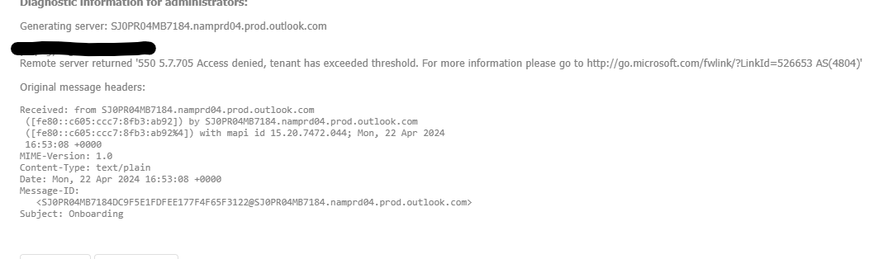

## Resolving Email Sending Issues in Demo Tenant

### IP Address Issue Resolution Guide
This guide addresses a common issue encountered when sending emails through a demo tenant, typically resulting in failures due to IP address problems. This issue often arises from emails being sent from IP addresses with low reputation, a scenario frequent in new or trial tenants.

#### Issue snapshots

### Solution Steps
1. Access the Azure Portal
Action: Log into your demo tenant's Azure portal.

2. Initiate a Support Request
Action: Search for the 'Support Request' option within the portal and open a new ticket. The specific category chosen is less important, as the Azure team will redirect you to the appropriate team if necessary.

3. Provide Necessary Details
Action: Attach a screenshot of the email error you are experiencing.
Additional Resource: Include this [Microsoft Q&A](https://statics.teams.cdn.office.net/evergreen-assets/safelinks/1/atp-safelinks.html) link in your ticket for context.

4. Follow-Up and Specific Request
Action: After submitting the ticket, Azure support will contact you. They typically have a standard process to follow before adding your tenant to an exclusion list. Confirm that you have tried their initial solutions and they were unsuccessful. Then, specifically request to be added to the exclusion list.

### Email Sending Issue Resolution Guide

This guide provides steps to resolve issues encountered when when the number of emails sent from demo tenants surpasses the limits set by Outlook.

#### Issue snapshots

### Steps to Identify and Resolve the Issue

1. Access Microsoft Admin Portal

- **Action**: Log into your demo tenant's Microsoft Admin Portal.
- **URL**: [Microsoft Admin Portal](https://admin.microsoft.com/AdminPortal/Home#/homepage)

2. Investigate Security Reports

- **Action**: Navigate to the security settings and access the email-related reports. Look for any notifications or reports that suggest reasons for blocked or limited email sending capabilities.
- **Tip**: Capture screenshots of relevant sections that show abnormalities or block notices.

3. Open a Support Ticket with Azure

- **Action**: Initiate a support request through the Azure portal to address the email sending issue.
- **Procedure**:
  1. Search for the 'Support Request' option within the portal and open a new ticket.
  2. Attach screenshots of the email error and any relevant reports from the admin portal.
  3. Include links to Microsoft's email sending limitations documentation for reference.
  4. URL for email limitations: [Sending limits in Outlook.com](https://support.microsoft.com/en-us/office/sending-limits-in-outlook-com-279ee200-594c-40f0-9ec8-bb6af7735c2e)

4. Follow-Up with Azure Support

- **Action**: After submitting the ticket, maintain communication with Azure support. Provide additional information as requested and follow through with any recommended actions to resolve the email sending issue.
- **Note**: Ensure to specify the need for an expedited review if business operations are severely impacted and clarify that the tenant's security is not compromised; the issue stems solely from extensive testing that has led to exceeding Outlook's email sending limits.

