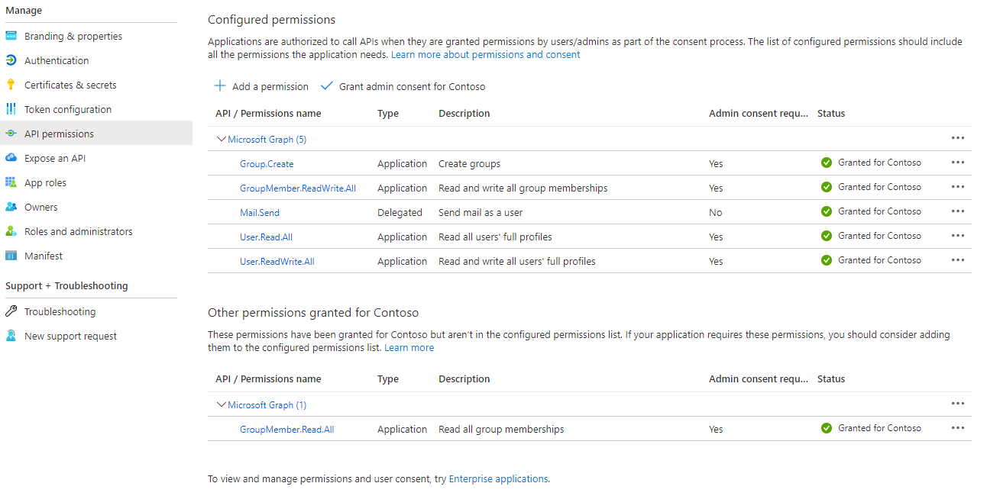

# NonProdService function

The NonProdService function will create and populate test groups in the tenant for use in GMM integration testing (or for sources in your own manual tests as well)

## Prerequisite: Add permission to Create Groups!!!
Before using this function, you must do the following to give GMM the proper permissions to execute

1. Navigate to Azure Portal in the tenant that you are running GMM for

2. Navigate to "App Registrations" and select the "All Applications" tab

3. Go to your gmm-Graph-<env> app registration

4. Go to the "API Permissions" tab and click "Add a permission"

5. Add the Microsoft.Graph > Group.Create permission

6. Click "Grant admin consent for Contoso" then confirm

7. Your API Permissions should now look like:

8. You are now ready to run the NonProdService function!