# GMM Notification Documentation

## Table of Contents

1. [Introduction](#introduction)
2. [Key Areas of Focus](#key-areas-of-focus)
3. [Notifications](#notifications)
   - [1. SyncStartedNotification](#notification-name-syncstartednotification)
   - [2. SyncCompletedNotification](#notification-name-synccompletednotification)
   - [3. DestinationNotExistNotification](#notification-name-destinationnotexistnotification)
   - [4. NoDataNotification](#notification-name-nodatanotification)
   - [5. NotOwnerNotification](#notification-name-notownernotification)
   - [6. SourceNotExistNotification](#notification-name-sourcenotexistnotification)
   - [7. InactiveSyncJobNotification](#notification-name-inactivesyncjobnotification)
   - [8. GuestUserFailureNotification](#notification-name-guestuserfailurenotification)
   - [9. ThresholdNotification](#notification-name-thresholdnotification)
   - [10. ThresholdNotificationDisabled](#notification-name-thresholdnotificationdisabled)
   - [11. ThresholdNotificationFallback](#notification-name-thresholdnotificationfallback)
   - [12. SubmissionRejectedNotification](#notification-name-submissionrejectednotification)
4. [Conclusion](#conclusion)
---

## Introduction

This document provides a detailed overview of all notifications sent by GMM. It includes information on each notification type, the purpose behind each message, the format used, and a visual example. This will serve as a comprehensive guide for understanding the structure and role of notifications within the GMM product.

## Key Areas of Focus

- **Purpose of Notification**: Why the notification is being sent and to whom.
- **Email Format**: Whether the notification uses the styled HTML template or a plain HTML body.
- **Triggered By**: The function or service that triggers this notification.
- **Example**: A visual representation of the notification 

---

## Notification Name SyncStartedNotification

### Purpose:
This email notifies the user that a synchronization job has started. It ensures the user is aware of the process initiation.

### Email Format:
- Format: Styled HTML email
- Visual Example: 

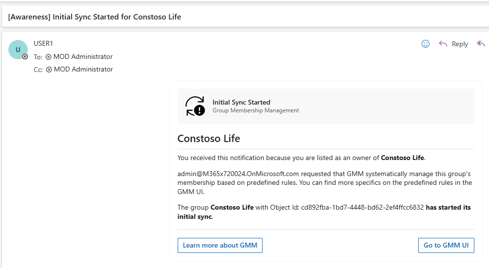

### Triggered By:
- **JobTrigger Function**: Responsible for initiating this notification when a sync job begins.

---

## Notification Name SyncCompletedNotification

### Purpose:
Sent to inform the user when a synchronization job is successfully completed. It helps the user know when their job has finished processing.

### Email Format:
- Format: Styled HTML email
- Visual Example: 

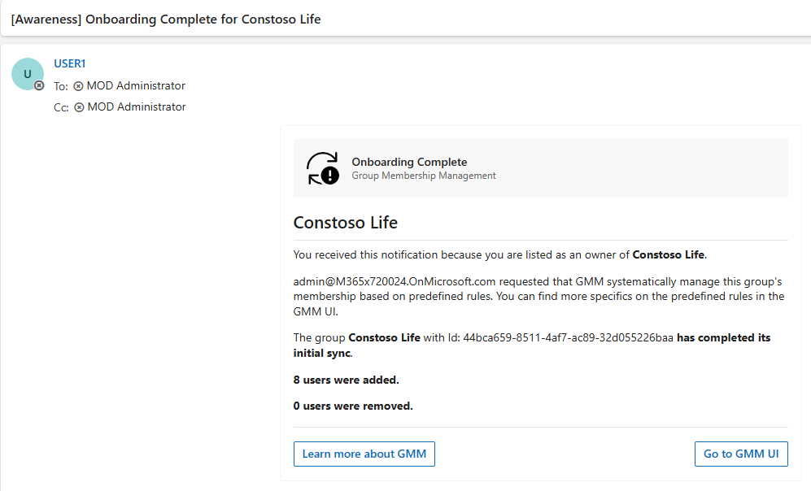

### Triggered By:
- **GraphUpdater** or **TeamsChannelUpdater**: Responsible for triggering the email when the sync job is marked as completed.

---

## Notification Name DestinationNotExistNotification

### Purpose:
This email informs the user that synchronization was disabled because the destination group does not exist. It helps in troubleshooting group-based issues during sync.

### Email Format:
- Format: Styled HTML email
- Visual Example: 

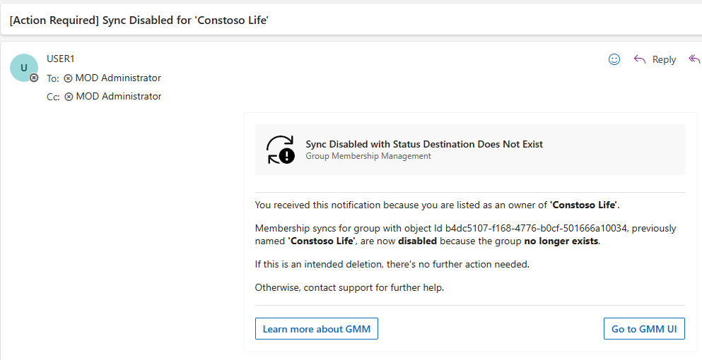

### Triggered By:
- **JobTrigger** and **GraphUpdater** Functions: These functions initiate this email if the destination group does not exist during the sync process.

---

## Notification Name NoDataNotification

### Purpose:
Informs the user that no data was found for the requested sync, providing clarity on the results of the sync operation.

### Email Format:
- Format: Styled HTML email
- Visual Example: 

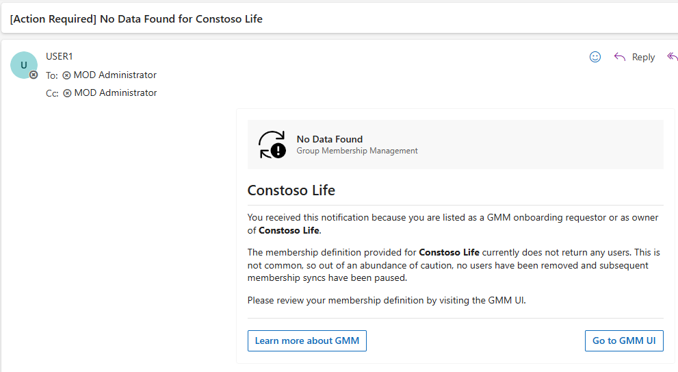

### Triggered By:
- **MembershipAggregator Function**: Responsible for sending this notification when no data is available during aggregation.

---

## Notification Name NotOwnerNotification

### Purpose:
Alerts the user that a synchronization job has been paused due to GMM is not an owner of the group, helping keep users informed about the status of their jobs.

### Email Format:
- Format: Styled HTML email
- Visual Example: 

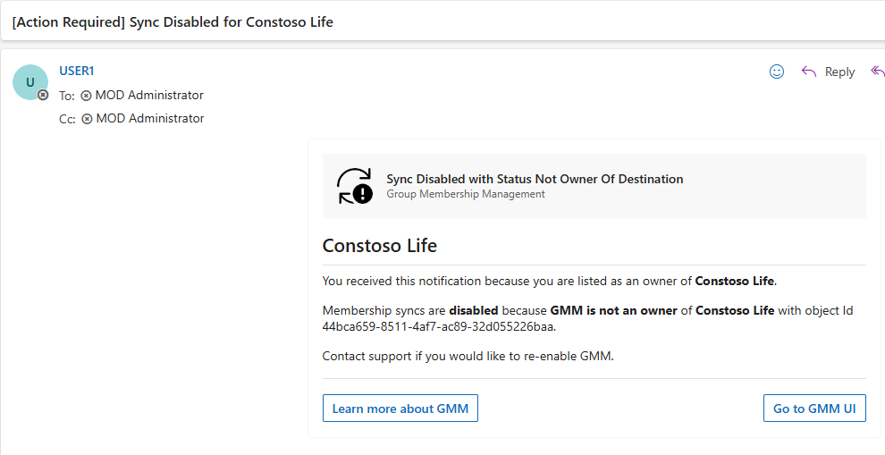

### Triggered By:
- **JobTrigger Function**: This function triggers the email after checking whether GMM is an owner of the group.

---

## Notification Name SourceNotExistNotification

### Purpose:
This email informs the user that synchronization was disabled because the source group no longer exist. It helps in troubleshooting group-based issues during sync.

### Email Format:
- Format: Styled HTML email
- Visual Example:

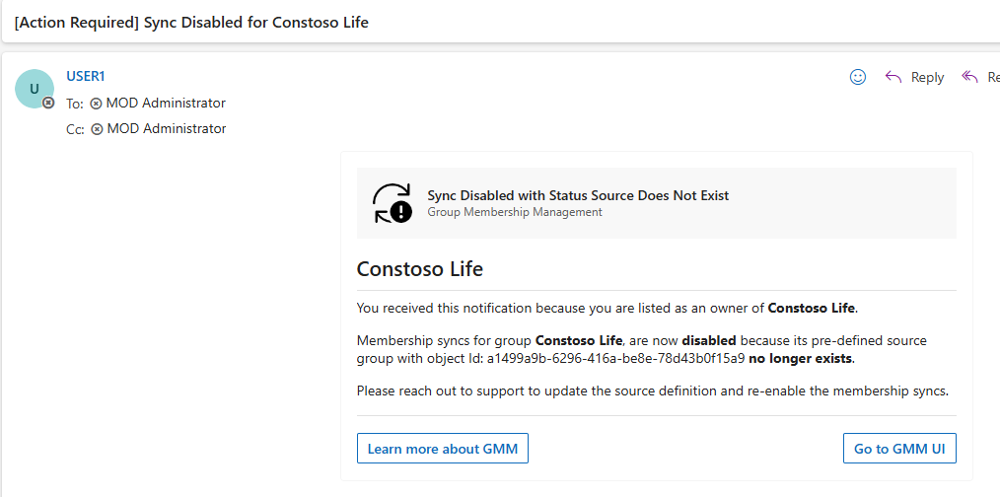

### Triggered By:
- **GroupMembershipObtainer Function**: These functions initiate this email if the source group does not exist during the sync process.

---

## Notification Name InactiveSyncJobNotification

### Purpose:
This email informs the user that their group’s synchronization with GMM has been disabled due to inactivity. It helps the user understand that their group no longer syncs with GMM and provides reasons for the inactivity, including the possibility that the source or destination group no longer exists, or that syncs were paused for too long.

### Email Format:
- Format: Styled HTML email
- Visual Example:

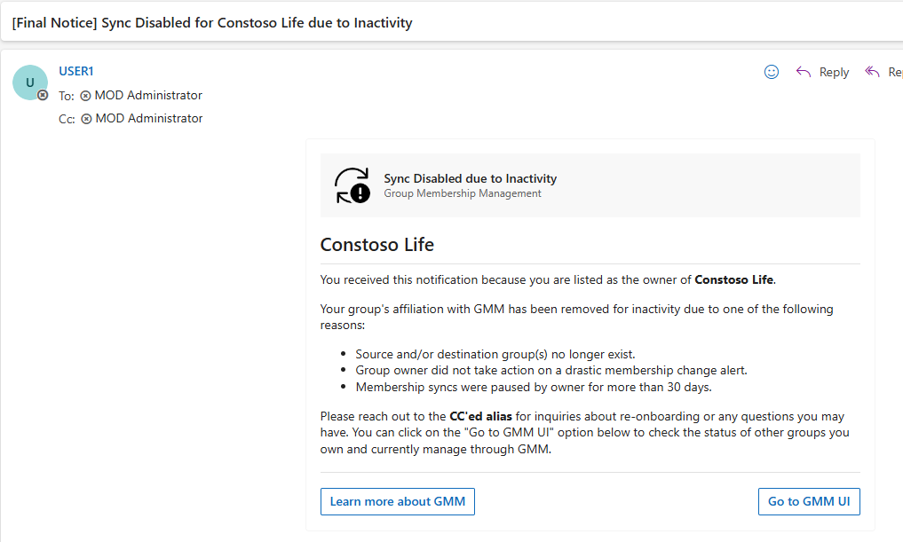

### Triggered By:
- **AzureMaintenance Function**: This function triggers the email if the group has been inactive for reasons such as the group no longer existing or the sync being paused for more than 30 days.

---

## Notification Name GuestUserFailureNotification

### Purpose:
This email informs the user that GMM was unable to add guest users to the destination group due to restrictions in the destination group’s settings, but it still processed the remaining user changes. It helps the user identify configuration issues related to guest user addition and informs them of actions that were still successfully performed by GMM.

### Email Format:
- Format: Styled HTML email
- Visual Example:

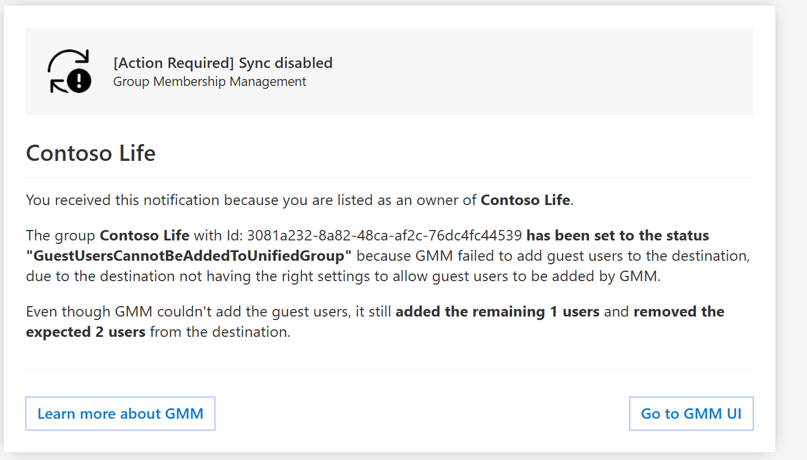

### Triggered By:
- **GraphUpdater Function**: This function triggers the email when guest users cannot be added to a destination group due to configuration restrictions in the destination settings.

---

## Notification Name ThresholdNotification

### Purpose:
This email informs the user that the most recent attempt to update the membership of their GMM-managed group exceeded the configured alert threshold, prompting the user to either approve the changes or pause the sync job.

### Email Format:
- Format: Styled HTML email
- Visual Example:

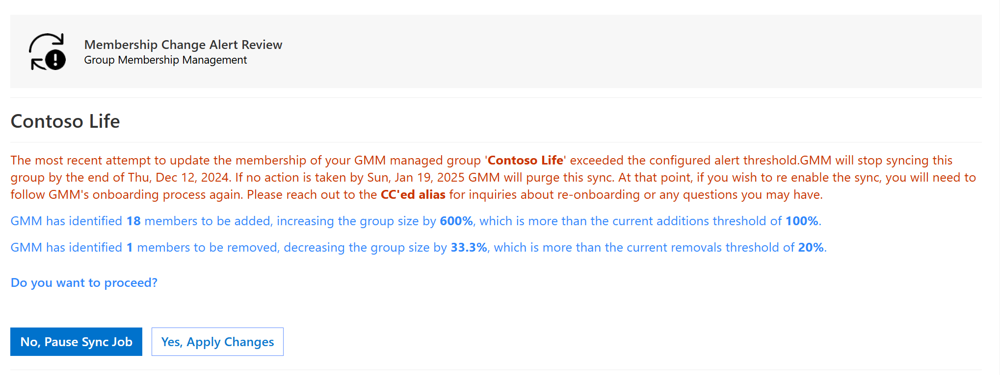

### Triggered By:
- **MembershipAggregator Function**: This notification is triggered when membership changes (additions or removals) exceed the preconfigured threshold for a group.

---
## Notification Name ThresholdNotificationDisabled

### Purpose:
This email informs the user that synchronization of their GMM group has been disabled. If no action is taken, the sync job will be deleted on the specified expiration date. The user is prompted to either proceed with pausing or re-enabling the sync.

### Email Format:
- Format: Styled HTML email
- Visual Example:

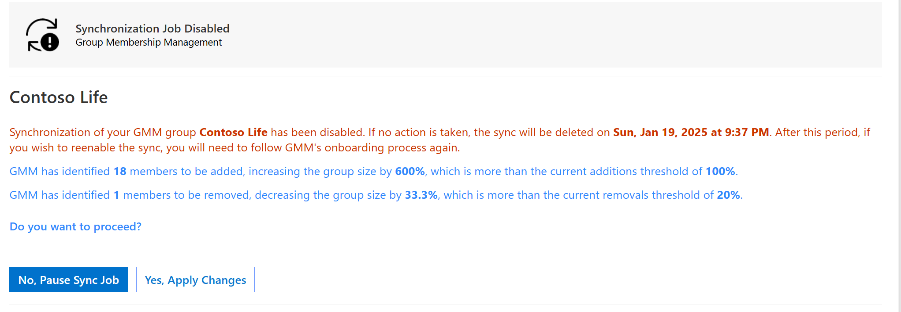

### Triggered By:
- **MembershipAggregator Function**: Triggered when the threshold for changes is exceeded after a certain number of days (as configured) without a response, causing the sync to be disabled.

---

## Notification Name ThresholdNotificationFallback

### Purpose:
This email is sent as a plain informational notification when the styled threshold email is not used. It summarizes the threshold violation and links the recipient to the run history in the GMM UI, where the notification can be reviewed and resolved.

### Email Format:
- Format: Plain HTML email
- Visual Example:

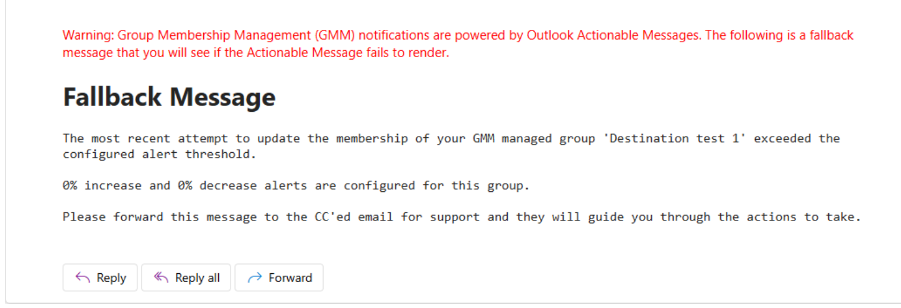

### Triggered By:
- **Notifier**: Triggered for a threshold notification when the styled threshold email is not produced. The recipient is still informed of the threshold violation and directed to the GMM UI to take action.

---

## Notification Name SubmissionRejectedNotification

### Purpose:
This email informs the user that their submission to onboard a new or modify an existing sync job has been rejected. It provides the reason for rejection and guides the user on next steps, including how to contact support or submit a new request if needed.

### Email Format:
- Format: Styled HTML email
- Visual Example:

### Triggered By:
- **Review Process in the UI**: Triggered when a user's request to onboard a new/modify an existing sync job is reviewed and rejected by GMM administrators.

---

## Conclusion

This document outlines the notifications sent by GMM, detailing the purpose, handling logic, and customization options for each. By centralizing email notifications under the Notifier function and using a consistent styled HTML template, we aim to streamline communication and enhance the user experience.
