# GMM Notification Documentation

## Table of Contents

1. [Introduction](#introduction)
2. [Key Areas of Focus](#key-areas-of-focus)
3. [Notifications](#notifications)
   - [1. SyncStartedNotification](#notification-name-syncstartednotification)
   - [2. SyncCompletedNotification](#notification-name-synccompletednotification)
   - [3. DestinationNotExistNotification](#notification-name-destinationnotexistnotification)
   - [4. NoDataNotification](#notification-name-nodatanotification)
   - [5. NotOwnerNotification](#notification-name-notownernotification)
   - [6. SourceNotExistNotification](#notification-name-sourcenotexistnotification)
   - [7. NestedGroupsFoundNotification](#notification-name-nestedgroupsfoundnotification)
   - [8. GuestUserFailureNotification](#notification-name-guestuserfailurenotification)
   - [9. ThresholdNotification](#notification-name-thresholdnotification)
   - [10. SubmissionRejectedNotification](#notification-name-submissionrejectednotification)
   - [11. JobPurgingWarningNotification](#notification-name-jobpurgingwarningnotification)
   - [12. FinalNotification](#notification-name-finalnotification)
4. [Conclusion](#conclusion)

---

## Introduction

This document describes GMM's owner-facing email notifications, including their purpose, format, triggering service, and visual examples where available. The screenshots show the customer-facing wording, including "Sync paused" for notifications that refer to a disabled sync job internally.

## Key Areas of Focus

- **Purpose of Notification**: Why the notification is being sent and to whom.
- **Email Format**: Whether the notification uses the styled HTML template or a plain HTML body.
- **Navigation**: **View in GMM UI** and **Review in GMM** open the job's run history. For **ThresholdNotification**, **Review in GMM** also opens the threshold take-action dialog. **Revise and resubmit** opens the **Job Details** page. **Start a new onboarding** opens the onboarding page.
- **Triggered By**: The function or service that triggers this notification.
- **Example**: A visual representation of the notification, or an explicit note when a screenshot is not yet available.

---

## Notifications

### Notification Name SyncStartedNotification

#### Purpose:
Notifies owners that their group's initial scheduled membership synchronization has started. It identifies the requesting user and group and explains what happens next. The **View in GMM UI** button opens the job's run history. No action is required from the recipient.

#### Email Format:
- Format: Styled HTML email
- Visual Example:

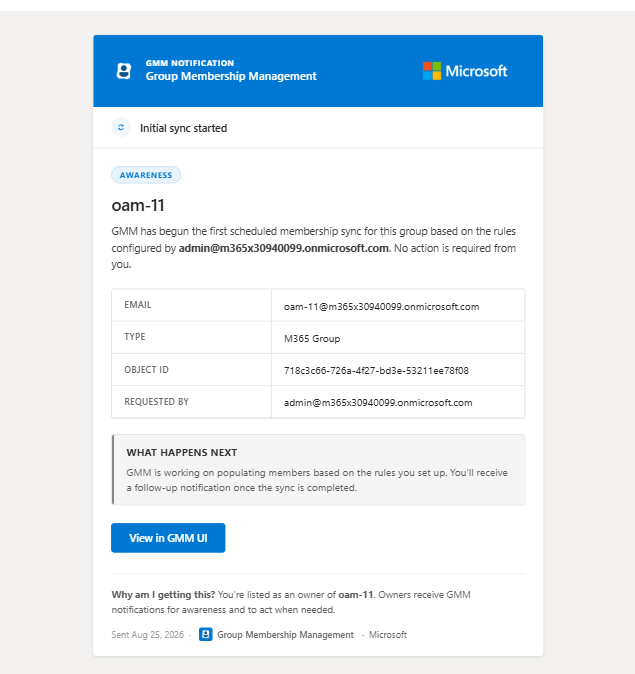

#### Triggered By:
- **JobTrigger Function**: Triggered when a sync starts for a job that has not yet completed its initial run.

---

### Notification Name SyncCompletedNotification

#### Purpose:
Notifies owners that their group's initial synchronization has completed and GMM is now managing membership. It summarizes the users added and removed and explains that future syncs follow the configured cadence. The **View in GMM UI** button opens the job's run history. No action is required from the recipient.

#### Email Format:
- Format: Styled HTML email
- Visual Example:

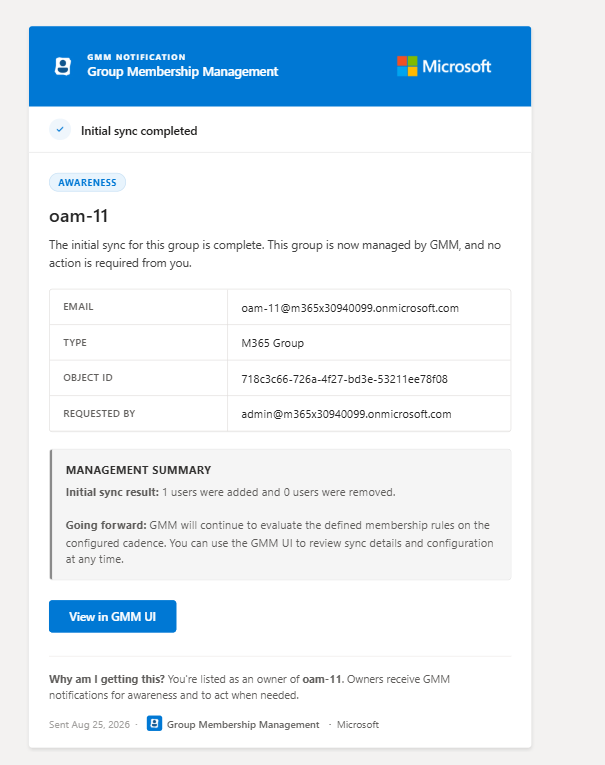

#### Triggered By:
- **GraphUpdater** or **TeamsChannelUpdater**: Triggered when the initial synchronization completes.

---

### Notification Name DestinationNotExistNotification

#### Purpose:
Informs owners that synchronization was paused because GMM could no longer find the destination group. The email uses the group's last known name and email address. Owners are directed to confirm whether the group exists and re-enable the sync if it is restored; no further action is needed if the deletion was intentional.

#### Email Format:
- Format: Styled HTML email
- Visual Example:

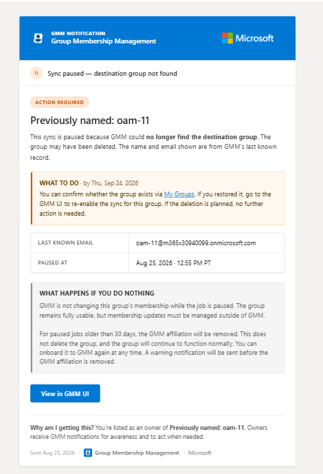

#### Triggered By:
- **JobTrigger** and **GraphUpdater** Functions: These functions initiate this email if the destination group does not exist during the sync process.

---

### Notification Name NoDataNotification

#### Purpose:
Informs owners that synchronization was paused because the membership rules returned zero users and the job does not allow an empty destination. GMM did not apply the membership changes, preventing the destination group from being unexpectedly emptied. Owners are directed to review the membership rules in the GMM UI.

#### Email Format:
- Format: Styled HTML email
- Visual Example:

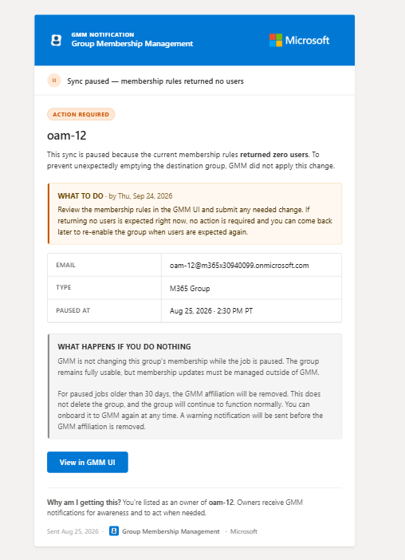

#### Triggered By:
- **MembershipAggregator Function**: Triggered when the aggregated source membership is empty and `AllowEmptyDestination` is false.

---

### Notification Name NotOwnerNotification

#### Purpose:
Informs owners that synchronization was paused because GMM is not an owner of the destination group. It identifies the GMM identity that must be restored as an owner and directs recipients to re-enable the sync in the GMM UI afterward. If GMM's ownership was removed intentionally, no further action is needed.

#### Email Format:
- Format: Styled HTML email
- Visual Example:

#### Triggered By:
- **JobTrigger Function**: This function triggers the email after checking whether GMM is an owner of the group.

---

### Notification Name SourceNotExistNotification

#### Purpose:
Informs owners that synchronization was paused because GMM could no longer find a source group referenced by the membership rules. It directs owners to replace the missing source group or remove the affected rule, then resubmit the configuration in the GMM UI.

#### Email Format:
- Format: Styled HTML email
- Visual Example:

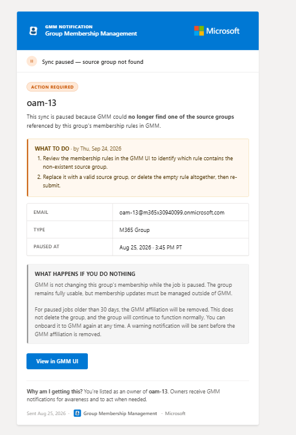

#### Triggered By:
- **GroupMembershipObtainer Function**: Triggered when a referenced source group does not exist during the sync process.

---

### Notification Name NestedGroupsFoundNotification

#### Purpose:
Informs owners that synchronization was paused because the destination group contains nested groups, which GMM cannot safely reconcile. It shows the detected count and up to five example groups by default, then directs owners to remove nested groups from the destination in Microsoft Entra and re-enable the sync in the GMM UI.

#### Email Format:
- Format: Styled HTML email
- Visual Example:

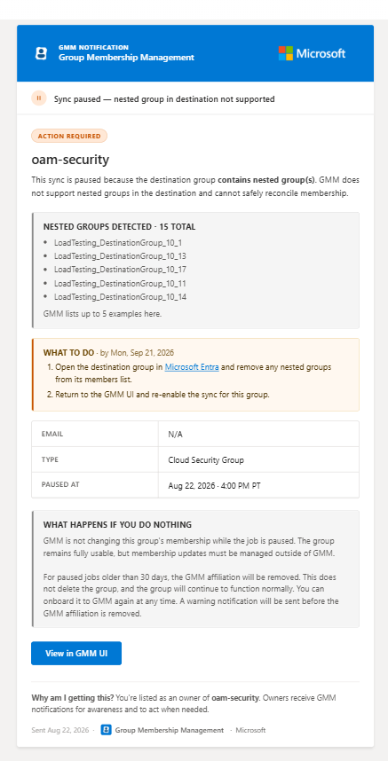

#### Triggered By:
- **GroupMembershipObtainer Function**: Triggered when nested groups are detected while reading the destination group's membership.

---

### Notification Name GuestUserFailureNotification

#### Purpose:
Informs owners that synchronization was paused because guest users from the membership source could not be added. It reports the additions and removals completed before the pause and directs owners to remove guest users from the source, then re-enable the sync. If guests are required, the email explains that they must be managed outside GMM.

#### Email Format:
- Format: Styled HTML email
- Visual Example:

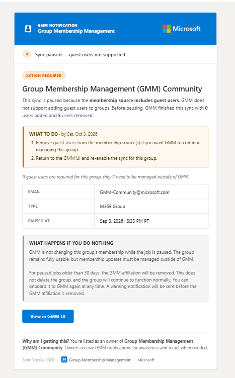

#### Triggered By:
- **GraphUpdater Function**: Triggered when guest users cannot be added to the destination group and the sync is paused.

---

### Notification Name ThresholdNotification

#### Purpose:
Informs owners that synchronization was paused because proposed membership additions or removals exceeded the configured alert threshold. It summarizes the proposed changes and threshold. The **Review in GMM** button opens the job's run history with the threshold take-action dialog. Owners can run a pre-approval check on specific members, approve the changes, or edit the membership rules. The email also explains the action deadline and consequences of leaving the job paused, including removal of GMM's affiliation without deleting the group.

#### Email Format:
- Format: Styled HTML email
- Visual Example:

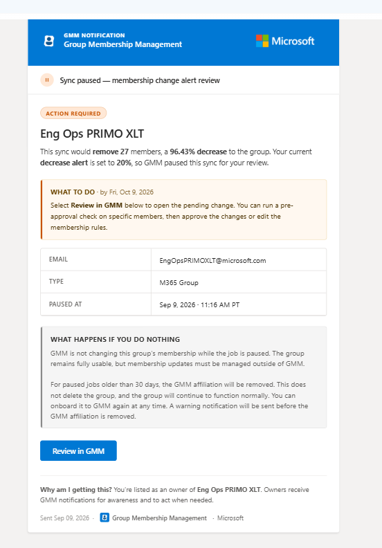

#### Triggered By:
- **MembershipAggregator Function**: This notification is triggered when membership changes (additions or removals) exceed the preconfigured threshold for a group.

---

### Notification Name SubmissionRejectedNotification

#### Purpose:
Informs owners that their submission to onboard a new sync job or modify an existing one requires revision. It includes the reviewer's feedback and guidance to update and resubmit the membership configuration. The **Revise and resubmit** button opens the **Job Details** page in the GMM UI. The email also provides a support contact and explains what happens if the rejected submission is left unresolved.

#### Email Format:
- Format: Styled HTML email
- Visual Example:

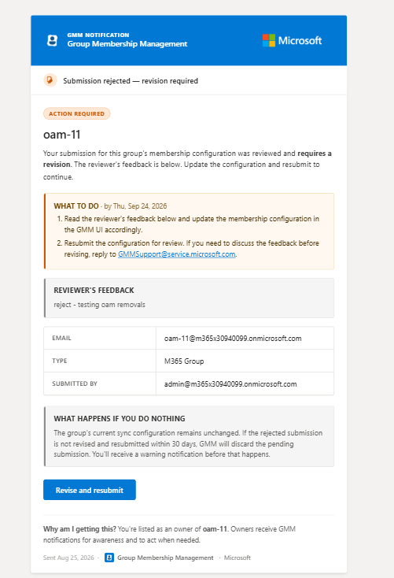

#### Triggered By:
- **WebApi**: Triggered when a GMM reviewer rejects an onboarding or update submission. Notifier delivers the email.

---

### Notification Name JobPurgingWarningNotification

#### Purpose:
Warns owners that an inactive sync job is approaching removal from GMM. The example gives seven days to act and includes the previous notification reason, the action deadline, and steps to resolve the issue. The **Review in GMM** button opens the job's run history. The email clarifies that removing GMM's affiliation does not delete the group or its existing members.

#### Email Format:
- Format: Styled HTML email
- Visual Example:

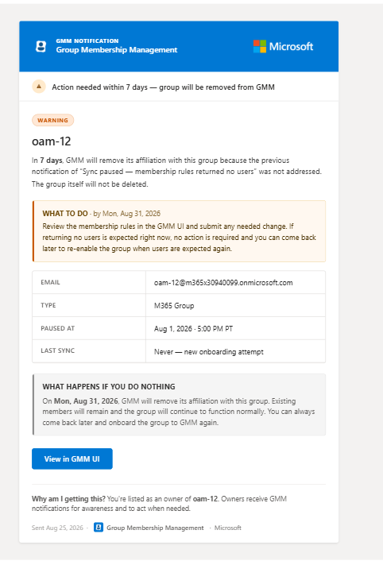

#### Triggered By:
- **AzureMaintenance Function**: Triggered when an eligible inactive job reaches the warning window before its scheduled purge.

---

### Notification Name FinalNotification

#### Purpose:
Sent after GMM removes an inactive sync job. The customer-facing email is titled **Final notice** and explains why GMM's affiliation with the group was removed. GMM does not delete the underlying group or its existing members. The **Start a new onboarding** button opens the onboarding page so owners can have GMM manage the group again.

#### Email Format:
- Format: Styled HTML email
- Visual Example:

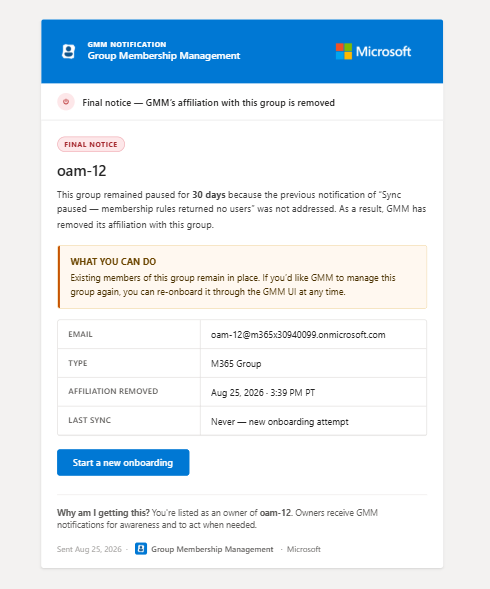

#### Triggered By:
- **AzureMaintenance Function**: Triggered after an eligible inactive sync job has been backed up and removed from GMM.

---

## Conclusion

This document links each notification to its purpose, trigger, and available visual example. The Notifier function centralizes delivery, using styled HTML emails and plain HTML fallbacks where applicable to give owners clear status information and next steps.
